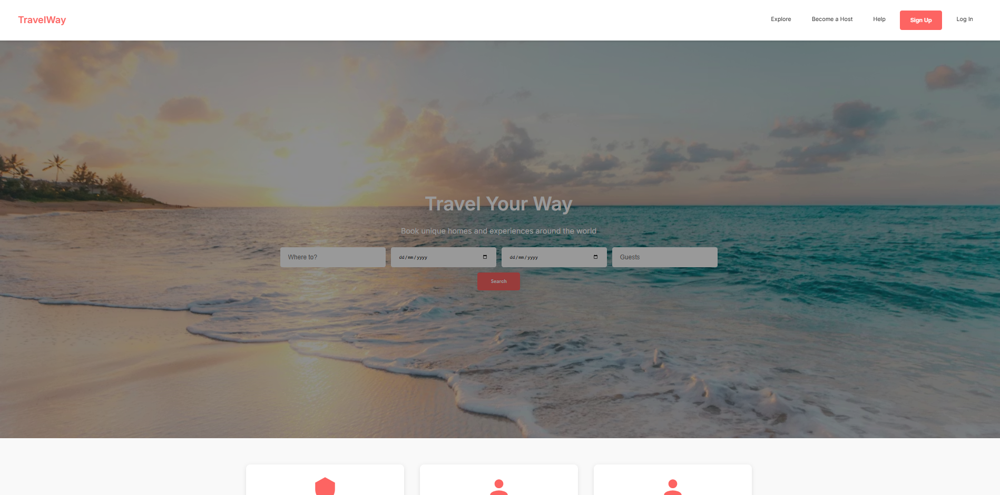

# TravelWay – Traveling Website

Copyright (c) 2025 TravelWay
All content, code, design, and visual elements of this project are the exclusive property of TravelWay.
Any unauthorized copying, distribution, modification, or use of this project, in whole or in part, is strictly prohibited without prior written permission from the owner.

---



Please click here to [view live demo](https://travelway.vercel.app)

---

## Overview

**TravelWay** is a modern traveling and tourism website designed to showcase destinations, travel guides, and experiences in a clean and visually engaging layout. The project focuses on usability, responsive design, and an intuitive browsing experience for users exploring travel options.

This project is ideal for a travel blog, tourism portfolio, or as a foundation for a full travel booking platform.

---

## Table of Contents

* [Features](#features)
* [Project Structure](#project-structure)
* [Technology](#technology)
* [Installation](#installation)
* [Future Improvements](#future-improvements)
* [License](#license)

---

## Features

* Destination showcase pages
* Clean and modern UI design
* Responsive layouts for all devices
* Travel highlights and image galleries
* Smooth scrolling and hover effects
* Easy-to-extend structure for future features

---

## Project Structure

```
TravelWay/
│
├── index.html          # Main landing page
├── css/
│   └── style.css       # Main stylesheet
├── js/
│   └── script.js       # JavaScript interactions
├── images/             # Images and assets
├── Screenshot.png      # Preview image
└── README.md           # Project documentation
```

---

## Technology

* HTML5 – Semantic structure
* CSS3 – Modern layouts and styling
* JavaScript – Interactive elements
* Responsive web design

---

## Installation

1. Clone the repository:

   ```bash
   git clone https://github.com/your-username/TravelWay.git
   ```
2. Open the project folder
3. Run `index.html` in your browser

No additional setup is required.

---

## Future Improvements

* Blog system for travel articles
* Interactive maps and location pins
* Booking or inquiry forms
* CMS or API integration

---

## License

This project is proprietary software. All rights reserved.
